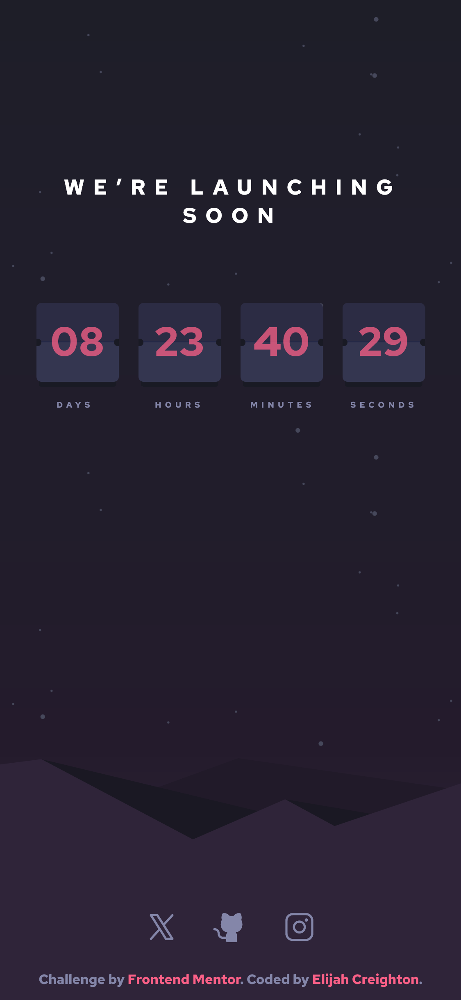
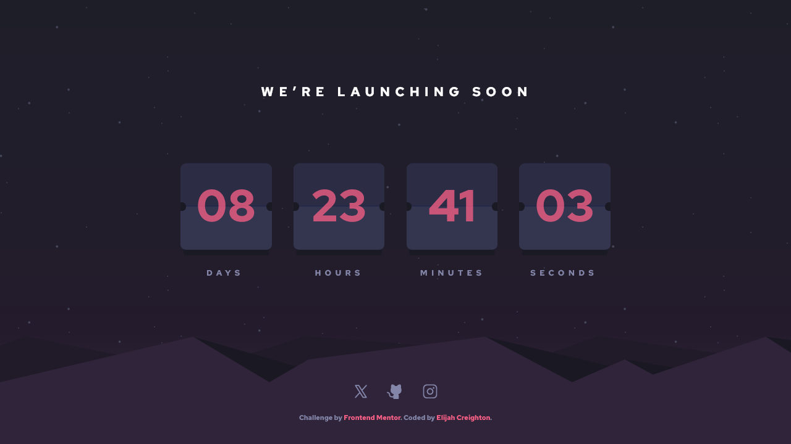

# Frontend Mentor - Launch countdown timer solution

This is a solution to the [Launch countdown timer challenge on Frontend Mentor](https://www.frontendmentor.io/challenges/launch-countdown-timer-N0XkGfyz-).

## Table of contents

- [Overview](#overview)
  - [The challenge](#the-challenge)
  - [Screenshots](#screenshots)
  - [Links](#links)
- [My process](#my-process)
  - [Built with](#built-with)
  - [Continued development](#continued-development)
- [Author](#author)

## Overview

### The challenge

Users should be able to:

- [x] See hover states for all interactive elements on the page
- [x] See a live countdown timer that ticks down every second (start the count at 14 days)
- [ ] **Bonus**: When a number changes, make the card flip from the middle
  - I feel so close to completing this bonus objective. I made animations for this exact purpose and they look great. I just need to figure out a way to rig it up so that the animation plays at the right time. I'll get back to it another time.

### Screenshots

### Links

- Solution URL: [Add solution URL here](https://creightoneli.github.io)
- Live Site URL: [https://creightoneli.github.io/launch-countdown](https://creightoneli.github.io/launch-countdown)

## My process

### Built with

- Semantic HTML5 markup
- CSS custom properties
- Flexbox
- Mobile-first workflow

### Continued development

As I stated in the challenge section, I would like to continue working on this until I get the cards flipping properly. I already think I know how to do it, I just need to do it. Hopefully I can update this readme soon with the completion of that bonus objective.

## Author

- Website - [creightoneli.github.io](https://creightoneli.github.io/)
- Frontend Mentor - [@CreightonEli](https://www.frontendmentor.io/profile/CreightonEli)
- Twitter - [@creightone_dev](https://x.com/creightone_dev)
- Instagram - [creightone.dev](https://www.instagram.com/creightone.dev/)